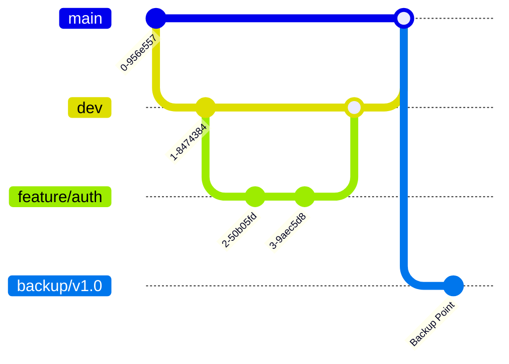

# SECURE GIT BRANCH BACKUP SYSTEM

Dokumen ini menjelaskan sistem backup dan manajemen branch Git yang aman, terstruktur, dan dirancang untuk ketahanan jangka panjang. Sistem ini cocok untuk solo developer maupun tim kecil yang mengutamakan keamanan data dan kemampuan pemulihan bencana (*disaster recovery*).

## 1. Strategi Branching Aman (Secure Branching Workflow)

Kami menggunakan adaptasi dari **Gitflow** yang disederhanakan untuk fleksibilitas namun tetap ketat dalam keamanan.

| Nama Branch | Tipe | Fungsi Utama | Sifat |
| :--- | :--- | :--- | :--- |
| `main` | **Produksi** | Kode yang stabil dan siap deploy (production-ready). | **Protected** (Tidak boleh push langsung) |
| `dev` | **Integrasi** | Tempat berkumpulnya fitur sebelum ke main. | Semi-Protected |
| `feature/*` | **Kerja** | Pengembangan fitur baru (contoh: `feature/login-page`). | Sementara (Hapus setelah merge) |
| `hotfix/*` | **Darurat** | Perbaikan bug kritis langsung dari main. | Sementara |
| `backup/*` | **Arsip** | Snapshot dari kondisi tertentu (contoh: `backup/main-20231027`). | **Abadi** (Jangan dihapus kecuali lama) |

### Visualisasi Alur



---

## 2. Perintah Git Esensial (Cheat Sheet)

### A. Membuat Backup Manual dari Main
Gunakan ini sebelum melakukan merge besar atau deployment.

```bash
# 1. Pastikan main terbaru
git checkout main
git pull origin main

# 2. Buat branch backup dengan timestamp hari ini
git checkout -b backup/main-$(date +%Y%m%d-%H%M)

# 3. Push backup ke remote (PENTING)
git push origin HEAD
```

### B. Memulai Pekerjaan Baru (Feature Branch)
Selalu mulai dari `dev` (atau `main` jika belum ada `dev`).

```bash
git checkout dev
git pull origin dev
git checkout -b feature/nama-fitur-anda
```

### C. Simpan Perubahan (Commit & Push)

```bash
git add .
git commit -m "feat: menambahkan login form"
git push origin feature/nama-fitur-anda
```

### D. Restore/Rollback dari Backup
Jika `main` rusak, kembalikan dari backup terakhir.

```bash
# 1. Hapus branch main lokal yang rusak (pastikan tidak sedang di main)
git checkout dev
git branch -D main

# 2. Ambil dari branch backup
git checkout backup/main-20231027-0900
git checkout -b main

# 3. Paksa update remote main (HANYA JIKA DARURAT & ANDA ADMIN)
git push -f origin main
```

---

## 3. Otomasi Backup (Auto-Backup Script)

Script ini akan mem-backup seluruh repository (semua branch dan tag) ke dalam satu file bundle tertutup. File ini bisa digunakan untuk me-restore repository di mesin lain tanpa internet.

### Script: `auto_backup.sh`

Simpan script ini di root project atau folder khusus script.

```bash
#!/bin/bash

# Konfigurasi
BACKUP_DIR="./git_backups"
TIMESTAMP=$(date +"%Y%m%d_%H%M%S")
PROJECT_NAME=$(basename $(git rev-parse --show-toplevel))
BACKUP_FILE="${BACKUP_DIR}/${PROJECT_NAME}_full_backup_${TIMESTAMP}.bundle"
LOG_FILE="${BACKUP_DIR}/backup_log.txt"

# Buat folder backup jika belum ada
mkdir -p "$BACKUP_DIR"

echo "[$(date)] Memulai backup untuk $PROJECT_NAME..." | tee -a "$LOG_FILE"

# Pastikan semua ref lokal terupdate
git fetch --all

# Buat bundle dari semua branch dan tag
# --all menyertakan semua refs
if git bundle create "$BACKUP_FILE" --all; then
    echo "[$(date)] SUKSES: Backup tersimpan di $BACKUP_FILE" | tee -a "$LOG_FILE"
else
    echo "[$(date)] GAGAL: Terjadi kesalahan saat membuat bundle." | tee -a "$LOG_FILE"
    exit 1
fi

# Verifikasi file bundle
if git bundle verify "$BACKUP_FILE"; then
    echo "[$(date)] VERIFIKASI: File bundle valid." | tee -a "$LOG_FILE"
else
    echo "[$(date)] VERIFIKASI: File bundle rusal/invalid." | tee -a "$LOG_FILE"
fi

echo "----------------------------------------" | tee -a "$LOG_FILE"
```

### Cara Penggunaan:
1. Beri izin eksekusi: `chmod +x auto_backup.sh`
2. Jalankan: `./auto_backup.sh`
3. File `.bundle` akan muncul di folder `git_backups`.

### Struktur Folder Backup
```
my-project/
├── .git/
├── src/
├── git_backups/                <-- Diabaikan oleh .gitignore
│   ├── my-project_full_backup_20231027_0800.bundle
│   ├── my-project_full_backup_20231028_0800.bundle
│   └── backup_log.txt
└── auto_backup.sh
```

**Catatan:** Tambahkan `git_backups/` ke dalam `.gitignore` agar file backup tidak ikut ter-commit ke repo.

---

## 4. Disaster Recovery Level Lanjut: Mirroring

Jika GitHub down atau akun terkunci, Anda perlu mirror di tempat lain (misal: GitLab, Bitbucket, atau server kantor).

### Cara Mirroring ke Remote Kedua
1. Tambahkan remote baru:
   ```bash
   git remote add secondary https://gitlab.com/username/project-mirror.git
   ```

2. Push semua branch dan tag sekaligus:
   ```bash
   git push --mirror secondary
   ```
   *Perintah ini akan menyamakan remote `secondary` persis dengan lokal Anda, termasuk menghapus branch di remote yang tidak ada di lokal.*

---

## 5. Mengamankan Branch Utama (Branch Protection)

Ini wajib dilakukan di GitHub untuk mencegah penghapusan tidak sengaja atau push kode yang buruk.

1. Buka Repo di GitHub > **Settings** > **Branches**.
2. Klik **"Add branch protection rule"**.
3. Branch name pattern: `main`.
4. Centang opsi berikut:
   - [x] **Require a pull request before merging**: Mencegah push langsung.
   - [x] **Require approvals**: Minimal 1 orang (atau diri sendiri jika solo tapi ingin disiplin).
   - [x] **Do not allow bypassing this rule**: Admin pun harus ikut aturan.
   - [x] **Lock branch**: (Opsional) Jika branch sedang "frozen" untuk rilis.

---

## 6. Best Practices

### A. Format Commit Message (Conventional Commits)
Gunakan format standar agar log mudah dibaca.
`tipe(scope): deskripsi singkat`

- `feat`: Fitur baru
- `fix`: Perbaikan bug
- `docs`: Dokumentasi
- `style`: Formatting, titik koma (tanpa ubah logika)
- `refactor`: Refactoring kode
- `chore`: Update dependency, script build

**Contoh:**
- `feat(login): menambahkan validasi email`
- `fix(header): memperbaiki logo yang tidak muncul`
- `chore: update versi laravel ke 10`

### B. Penamaan Branch
Gunakan `/` sebagai pemisah hirarki.
- `feature/tambah-user`
- `bugfix/fix-login-error`
- `hotfix/security-patch-v1`
- `backup/pre-deployment-2023`

---

## Ringkasan Checklist Keamanan

- [ ] Branch protection aktif untuk `main`.
- [ ] Script backup berjalan (bisa dijadwalkan via cronjob).
- [ ] Folder backup masuk `.gitignore`.
- [ ] Remote mirror disiapkan (opsional tapi disarankan).
- [ ] Tim paham cara restore dari bundle/branch backup.
